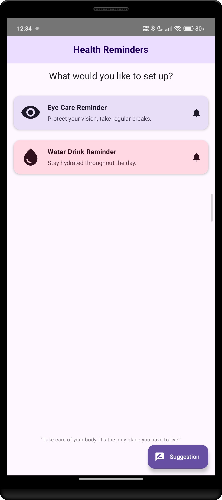
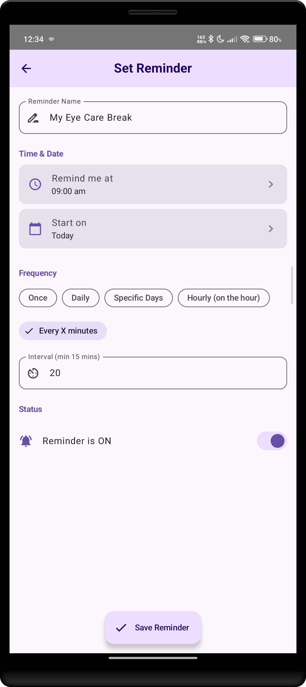
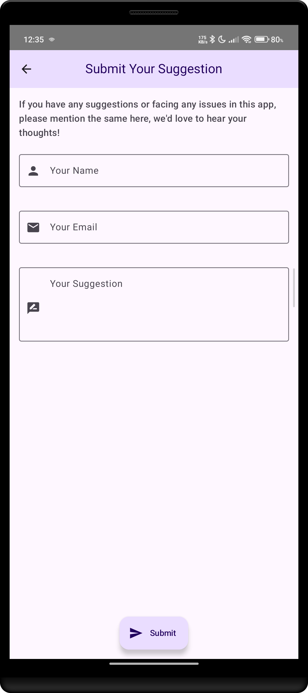

# Eye & Water Reminder App

**Ứng dụng nhắc nhở chăm sóc mắt và uống nước** - Phát triển bởi **Phạm Lê Ngọc Sơn**

---

## Giới thiệu

**Eye & Water Reminder** là ứng dụng Android được phát triển bởi **Phạm Lê Ngọc Sơn**, giúp người dùng bảo vệ sức khỏe mắt và duy trì thói quen uống nước đều đặn hàng ngày.

Trong thời đại số, việc ngồi trước màn hình máy tính và điện thoại quá lâu có thể gây hại cho mắt và khiến cơ thể thiếu nước. Ứng dụng này sẽ tự động nhắc nhở bạn:

- Nghỉ ngơi mắt định kỳ để giảm căng thẳng thị giác (Digital Eye Strain)
- Uống nước đều đặn để đảm bảo cơ thể luôn đủ nước

---

## Tính năng chính

- **Nhắc nhở chăm sóc mắt**: Đặt lịch nhắc nghỉ mắt theo tần suất tuỳ chỉnh
- **Nhắc nhở uống nước**: Thiết lập nhắc nhở uống nước trong ngày
- **Tuỳ chỉnh linh hoạt**:
  - Một lần duy nhất
  - Hàng ngày
  - Hàng giờ (đúng giờ)
  - Mỗi X phút (tối thiểu 15 phút)
  - Chọn ngày cụ thể trong tuần
- **Tiêu đề nhắc nhở tuỳ chỉnh**: Tự đặt tên cho từng nhắc nhở
- **Chọn ngày và giờ bắt đầu**: Giao diện chọn thời gian trực quan
- **Bật/Tắt nhắc nhở**: Dễ dàng quản lý trạng thái nhắc nhở
- **Gợi ý và phản hồi**: Gửi gợi ý cải thiện ứng dụng trực tiếp từ trong app
- **Giao diện Material Design 3**: Hiện đại, thân thiện với người dùng
- **Splash Screen**: Màn hình khởi động với hiệu ứng loading
- **Thông báo thông minh**: Xử lý quyền thông báo cho Android 13+
- **Tiết kiệm pin**: Sử dụng WorkManager để lập lịch nền hiệu quả

---

## Công nghệ sử dụng

| Thành phần | Công nghệ |
|---|---|
| **Ngôn ngữ** | Kotlin |
| **Kiến trúc** | MVVM (Model-View-ViewModel) + Clean Architecture |
| **Giao diện** | Jetpack Compose |
| **Lưu trữ cục bộ** | Room Database |
| **Dependency Injection** | Hilt (Dagger) |
| **Xử lý bất đồng bộ** | Kotlin Coroutines & Flow |
| **Tác vụ nền** | WorkManager |
| **Backend** | Firebase Firestore (lưu trữ gợi ý người dùng) |
| **Kiểm tra chất lượng** | Detekt (phân tích tĩnh), ktlint |
| **Kiểm thử** | JUnit, Mockito, MockK, Turbine, Truth |
| **Độ phủ test** | JaCoCo |
| **CI/CD** | GitHub Actions |

---

## Kiến trúc dự án

Ứng dụng được xây dựng theo mô hình **Clean Architecture** với sự tách biệt rõ ràng giữa các tầng:

```
com.alpha.myeyecare/
│
├── common/                          # Tiện ích và hằng số dùng chung
│   ├── constants/
│   │   ├── AppDestinations.kt       # Định nghĩa các điểm đến Navigation
│   │   └── ReminderTypes.kt         # Định nghĩa loại nhắc nhở
│   └── utils/
│       ├── ExtensionFunctions.kt    # Hàm mở rộng tiện ích
│       └── UtilFunctions.kt         # Hàm tiện ích chung
│
├── data/                            # Tầng dữ liệu (Data Layer)
│   ├── local/                       # Lưu trữ cục bộ
│   │   ├── converters/
│   │   │   └── Converters.kt        # Chuyển đổi kiểu dữ liệu cho Room
│   │   ├── dao/
│   │   │   └── ReminderDao.kt       # Data Access Object
│   │   ├── entities/
│   │   │   └── Reminder.kt          # Entity của Room Database
│   │   └── ReminderDatabase.kt      # Cấu hình Room Database
│   └── repository/                  # Hiện thực Repository
│       ├── ReminderRepositoryImpl.kt
│       └── SuggestionRepositoryImpl.kt
│
├── di/                              # Dependency Injection
│   ├── AppModule.kt                 # Module chính của ứng dụng
│   ├── DatabaseModule.kt            # Module cấu hình Database
│   └── RemoteModule.kt              # Module cấu hình Firebase
│
├── domain/                          # Tầng logic nghiệp vụ (Domain Layer)
│   ├── model/                       # Các model dữ liệu
│   │   ├── DayOfWeek.kt
│   │   ├── ReminderDetails.kt
│   │   ├── ReminderFrequency.kt
│   │   └── Suggestion.kt
│   ├── repository/                  # Giao diện Repository (abstraction)
│   │   ├── ReminderRepository.kt
│   │   └── SuggestionRepository.kt
│   └── useCases/                    # Các Use Case
│       ├── CheckReminderStatusUseCase.kt
│       ├── GetReminderDetailsUserCase.kt
│       ├── SaveReminderUseCase.kt
│       └── SaveSuggestionsUseCase.kt
│
├── presentation/                    # Tầng giao diện (Presentation Layer)
│   ├── navigation/
│   │   └── NavGraph.kt              # Định nghĩa Navigation Graph
│   └── ui/
│       ├── common/
│       │   └── CommonUI.kt          # Các thành phần UI dùng chung
│       ├── detailScreen/
│       │   ├── SetupReminderScreen.kt    # Màn hình cài đặt nhắc nhở
│       │   └── SetupReminderViewModel.kt
│       ├── home/
│       │   └── HomeScreen.kt        # Màn hình chính
│       ├── splash/
│       │   ├── SplashScreen.kt      # Màn hình khởi động
│       │   └── SplashViewModel.kt
│       ├── suggestion/
│       │   ├── SuggestionSubmissionViewModel.kt
│       │   └── UserSuggestionScreen.kt   # Màn hình gửi gợi ý
│       └── theme/
│           ├── Color.kt             # Định nghĩa màu sắc
│           ├── Theme.kt             # Định nghĩa theme
│           └── Type.kt              # Định nghĩa kiểu chữ
│
├── worker/                          # Xử lý tác vụ nền
│   ├── ReminderScheduler.kt         # Lập lịch nhắc nhở
│   └── ReminderWorker.kt            # Worker thực thi nhắc nhở
│
├── MainActivity.kt                  # Activity chính
└── MyApplication.kt                 # Application class (Hilt entry point)
```

---

## Ảnh chụp màn hình

| Màn hình chính | Cài đặt nhắc nhở | Gợi ý |
|---|---|---|
|  |  |  |

**Mô tả các màn hình:**

1. **Splash Screen**: Màn hình khởi động với logo ứng dụng và thanh tiến trình loading
2. **Home Screen**: Màn hình chính hiển thị 2 tuỳ chọn - Nhắc nhở mắt và Nhắc nhở uống nước
3. **Setup Reminder Screen**: Màn hình cài đặt chi tiết cho nhắc nhở (tần suất, ngày giờ, tiêu đề...)
4. **Suggestion Screen**: Màn hình gửi phản hồi và gợi ý cải thiện ứng dụng

---

## Quy trình CI/CD

Dự án tích hợp **GitHub Actions** để đảm bảo chất lượng code:

| Bước | Mô tả |
|---|---|
| **Debug Build Check** | Kiểm tra code có biên dịch thành công hay không |
| **Detekt Check** | Phân tích tĩnh code Kotlin, đảm bảo code sạch và dễ bảo trì |
| **Unit Tests** | Chạy unit test và kiểm tra độ phủ code (yêu cầu >= 80%) |

Quy trình này tự động chạy khi có **Pull Request** hoặc **push** vào nhánh `main`.

---

## Yêu cầu hệ thống

- **Android**: API 24 (Android 7.0 Nougat) trở lên
- **Target SDK**: 35 (Android 15)
- **JDK**: 17 (để build dự án)
- **Gradle**: 8.x (Kotlin DSL)

---

## Hướng dẫn cài đặt và chạy dự án

### Bước 1: Clone repository

```bash
git clone https://github.com/phamlengocson/Eye-Water-Reminder-App.git
cd Eye-Water-Reminder-App
```

### Bước 2: Mở dự án

Mở dự án bằng **Android Studio** (phiên bản mới nhất được khuyến nghị).

### Bước 3: Đồng bộ Gradle

Android Studio sẽ tự động đồng bộ các dependency. Nếu không, chọn **File > Sync Project with Gradle Files**.

### Bước 4: Cấu hình Firebase

Dự án sử dụng Firebase Firestore cho tính năng gợi ý. Bạn cần:
1. Tạo dự án trên [Firebase Console](https://console.firebase.google.com/)
2. Tải file `google-services.json` và đặt vào thư mục `app/`
3. Bật Firestore Database trong Firebase Console

### Bước 5: Build và chạy

- Chọn thiết bị/emulator Android (API >= 24)
- Nhấn **Run** hoặc sử dụng lệnh:

```bash
./gradlew assembleDebug
```

---

## Kiểm thử

### Chạy unit tests

```bash
./gradlew testDebugUnitTest
```

### Tạo báo cáo độ phủ code (JaCoCo)

```bash
./gradlew clean testDebugUnitTest jacocoTestReport
```

Báo cáo sẽ được tạo tại: `app/build/reports/jacoco/jacocoTestReport/`

### Chạy kiểm tra Detekt

```bash
./gradlew detekt
```

---

## Thông tin phiên bản

| Phiên bản | Mã phiên bản | Ngày phát hành |
|---|---|---|
| 1.1.0 | 2 | 27/08/2025 |
| 1.0.0 | 1 | 19/08/2025 |

---

## Tác giả

**Phạm Lê Ngọc Sơn**

- **Vai trò**: Developer & Owner
- **Dự án**: Eye & Water Reminder App
- **Công nghệ chuyên môn**: Android Development, Kotlin, Jetpack Compose, Clean Architecture

---

## Giấy phép

Dự án này thuộc quyền sở hữu của **Phạm Lê Ngọc Sơn**. Mọi quyền được bảo lưu.

Copyright (c) 2025 Phạm Lê Ngọc Sơn. All rights reserved.
